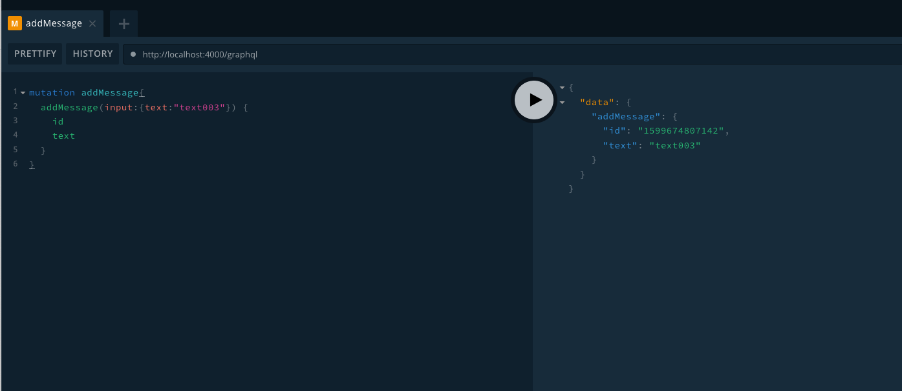

# Part II. Multiple API settings with Apollo GraphQL

**Multiple API settings example to start an Apollo GraphQL API on Node Express Server**
**This tutorial guide you to create a basic graphql API using the apollo-server-express. It contains 2 sets of API schema defnition, one of which contains a local storage. You will learn GrpahQL query and mutation.**



## 1. Check Node version
**Make sure you have Node v9+**

```
$ node -v
```

## 2. Clone the sample application repository

**Note there are 2 API examples under apollo-express-study/graphql-api/**
**This application only start one API at a time.**
<pre>
example
├── graphql-api
│   ├── books
│   │   ├── resolvers.js
│   │   └── typeDefs.js
│   └── messaging
│       ├── resolvers.js
│       ├── typeDefs.js
│       └── utils
│           ├── db.js
│           ├── db.json
│           └── upload.js
├── index.js
└── package.json
</pre>

## 3. Install libraries
```
$ cd apollo-express-study/example
$ npm install
```

## 4. Play with the "books" API
### 4-1. Edit apollo-express-study/.env
```
API_NAME=books
```

**With the settings above the application only use apollo-express-study/graphql-api/books this time.**

<pre>
example
├── graphql-api
│   ├── <b>books</b>
│   │   <b>├── resolvers.js</b>
│   │   <b>└── typeDefs.js</b>
│   └── messaging
│       ├── resolvers.js
│       ├── typeDefs.js
│       └── utils
│           ├── db.js
│           ├── db.json
│           └── upload.js
├── index.js
└── package.json
</pre>

### 4-2. Check the source code of the "books" API

**typeDefs.js**
```
module.exports = `
  type Query { 
    getAllBooks: [Book]
    getBooksByGender(gender: String): [Book]
  }
  
  type Book { 
    title: String
    author: String
    gender: String 
  }
`
```

**resolvers.js**
```
const initBooks = [
  {
    title: "Harry Potter and the Sorcerer's stone",
    author: 'J.K. Rowling',
    gender: 'F'
  },
  {
    title: 'Jurassic Park',
    author: 'Michael Crichton',
    gender: 'M'
  },
];

module.exports = {
  Query: { 
    getAllBooks: () => {
      return initBooks;
    },
    getBooksByGender: function (rootObj, {gender}) {
      return [initBooks[0]];
    }
  }
}
```

### 4-3. Start the GraphQL API Server
```
$ npm start
```

### 4-4. Test Queries on [Playground](http://localhost:4000/graphql)
```
query getAllBooks {
  getAllBooks {
    title
    author
    gender
  }
}

query getBooksByGender{
  getBooksByGender(gender:"Female") {
    title
    author
    gender
  } 
}
```

### 4-5. Stop the Node process

## 5. Play with the "messaging" API
### 5-1. Edit apollo-express-study/.env
```
API_NAME=messaging
```

**With the settings above the application only use apollo-express-study/graphql-api/messaging this time.**

<pre>
example
├── README.MD
├── graphql-api
│   ├── books
│   │   ├── resolvers.js
│   │   └── typeDefs.js
│   └── <b>messaging
│       ├── resolvers.js
│       ├── typeDefs.js
│       └── utils
│           ├── db.js
│           ├── db.json
│           └── upload.js</b>
├── index.js
└── package.json
</pre>

### 5-2. Check the source code of the "messaging" API

**typeDefs.js**
```
module.exports = `
# A text message send by users
type Message {
  id: ID!
  # Message content
  text: String!
}

# Input from user to create a message
input MessageInput {
  # Message content
  text: String!
}

type Query {
  # Test query with a parameter
  hello(name: String): String!
  # List of messages sent by users
  messages: [Message]
}

type Mutation {
  # Add a message and publish it on 'messages' subscription channel
  addMessage (input: MessageInput!): Message!
}

type Subscription {
  # When a new message is added
  messageAdded: Message!
}
`
```

**resolvers.js**
```
// const shortid = require('shortid');
const { db } = require('./utils/db');
const { PubSub } = require('graphql-subscriptions');

const pubsub = new PubSub();
const MESSAGE_ADDED_TOPIC = 'message_added';

module.exports = {

  Query: {
    hello: (root, { name }) => `Hello ${name || 'World'}!`,
    messages: (root, args) => db.get('messages').value()
  },

  Mutation: {
    addMessage: (root, { input }) => {
      const message = {
        // id: shortid.generate(),
        id: Date.now(),
        text: input.text
      };

      db
        .get('messages')
        .push(message)
        .last()
        .write();

      pubsub.publish(MESSAGE_ADDED_TOPIC, { messageAdded: message });

      return message;
    }
  },

  Subscription: {
    messageAdded: {
      subscribe: () => pubsub.asyncIterator(MESSAGE_ADDED_TOPIC)
    }
  }
}
```

### 5-3. Start the GraphQL API Server
```
$ npm start
```

### 5-4. Test Queries and Mutations on [Playground](http://localhost:4000/graphql)
**Check apollo-express-study/graphql-api/messaging/utils/db.json while testing.**

**Query the existing messages.**
```
query messages{
  messages {
    text
    id
  }
}
```

**Add new messages and you will find the changes in graphql-api/messaging/utils/db.json**
```
mutation addMessage{
  addMessage(input:{text:"text001"}) {
    id
    text
  }
}
```

### 5-5. Stop the Node process
