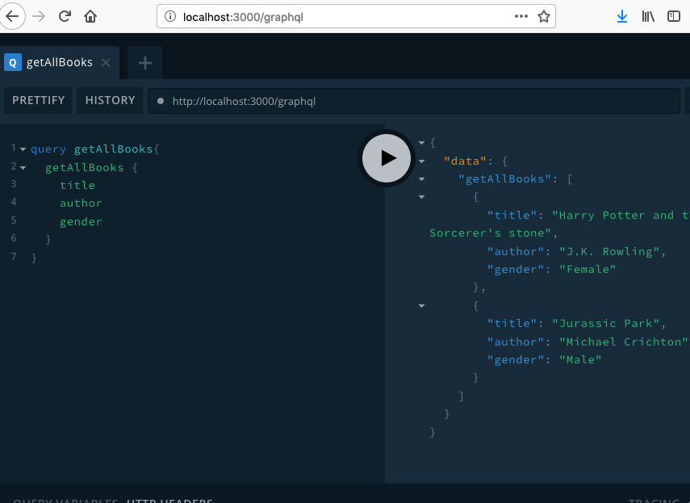

# Part I. Single file Apollo GraphQL API
**Use a single file as an Apollo GraphQL API on Node Express Server**
**This tutorial guide you to create a basic graphql API using the apollo-server-express. It contains only one index.js file with API schema defnition, mock-up data and a local express server with graphql plugin. You will learn GrpahQL query.**



## 1. Check Node version
**Make sure you have Node v9+**

```
$ node -v
```

## 2. Create a node.js app from scratch
**Create a folder for this app**
```
$ mkdir -p graphql-express-server-example
$ cd graphql-express-server-example
```

**Initialize this app with all default options**
```
$ npm init
```

## 3. Create a single index.js
### 3-1. Reference to Express and Apollo Server libraries
```
const express = require('express');
const { ApolloServer, gql } = require('apollo-server-express');
```

### 3-2. Add initial data
```
// Some mock-up data
const initBooks = [
  {
    title: "Harry Potter and the Sorcerer's stone",
    author: 'J.K. Rowling',
    gender: 'Female'
  },
  {
    title: 'Jurassic Park',
    author: 'Michael Crichton',
    gender: 'Male'
  },
];
```

### 3-3. Add Type Definitions
```
// The GraphQL schema in string form
const typeDefs = gql`
  type Query { 
    getAllBooks: [Book]
    getBooksByGender(gender: String): [Book]
  }
  type Book { title: String, author: String, gender: String }
`;
```

### 3-4. Add Resolvers for relative queries
```
// The resolvers
const resolvers = {
  Query: { 
    getAllBooks: () => {
      return initBooks;
    },
    getBooksByGender: function (rootObj, {gender}) {
      return [initBooks[0]];
    }
  }
};
```

### 3-5. Put together a schema and ApolloServer
```
const server = new ApolloServer({ typeDefs, resolvers });
```

### 3-6. Add code to start Express with Apollo GraphQL middleware
```
// Initialize the app
const app = express();
server.applyMiddleware({ app });


// Start the server
app.listen(3000, () => {
  console.log('Go to http://localhost:3000/graphql to run queries!');
});
```

## 4. Install dependencies
```
$ npm install --save apollo-server-express express
```

## 5. Start graphql-express-server and test
### 5-1. Start the Apollo GraphQL Server
```
$ npm start
```

### 5-2. Visit the GraphiQL URL on browser
http://localhost:3000/graphql


### 5-3. Run the following queries
```
query getAllBooks{
  getAllBooks {
    title
    author
    gender
  }
}
```

```
query getBooksByGender{
  getBooksByGender(gender:"Female") {
    title
    author
    gender
  } 
}
```

### 5-4. Stop the Node process
