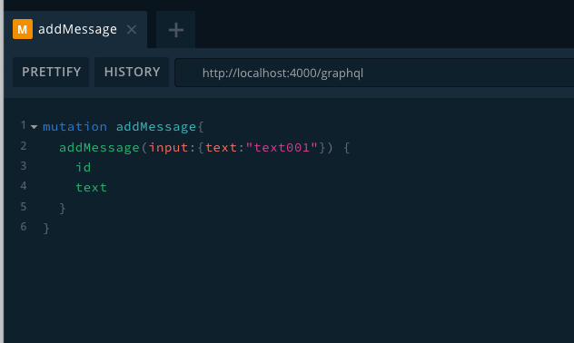
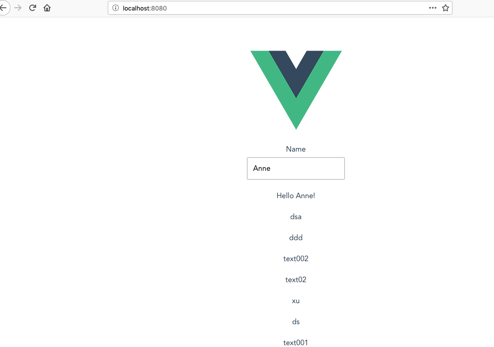

# Part III. Vue.js Application connecting to Apollo GraphQL

**Use vue-cli-plugin-apollo to start a Vue.js Application with Apollo GraphQL backend**
**This tutorial guide you to create vue application with graphql apollo support. It uses the messaging API from apollo-express-study. You will learn GrpahQL query, mutation, subscription.**

## 1. Check Node version
**Make sure you have Node v9+**

```
$ node -v
```

## 2. Check vue-cli version
**Make sure you have vue-cli 3+**

```
$ npm install -g @vue/cli
$ vue --version
```

## 3. Create this Vue.js application by vue-cli 3+ and vue-cli-plugin-apollo
### 3-1. Create project
```
$ vue create vue-apollo-study
Vue CLI v3.12.1

? Please pick a preset: 
  default (babel, eslint) 
❯ Manually select features 

? Please pick a preset: Manually select features
? Check the features needed for your project: 
 ◉ Babel
 ◯ TypeScript
 ◯ Progressive Web App (PWA) Support
❯◉ Router
 ◯ Vuex
 ◯ CSS Pre-processors
 ◯ Linter / Formatter
 ◯ Unit Testing
 ◯ E2E Testing

? Use history mode for router? (Requires proper server setup for index fallback in production) Yes
? Where do you prefer placing config for Babel, PostCSS, ESLint, etc.? (Use arrow keys)
❯ In dedicated config files 
  In package.json 

```

### 3-2. Add apollo plugin by vue-cli-plugin-apollo
```
$ cd vue-apollo-study
$ vue add apollo

? Add example code Yes
? Add a GraphQL API Server? No
? Configure Apollo Engine? No
```

## 4. Play with the application
### 4-1. Start the Apollo GraphQL backend created at [apollo-express-study](apollo-express-study.MD#5-play-with-the-messaging-api)

### 4-2. Start the Vue.js application
```
$ cd vue-apollo-study
$ npm run serve
```

### 4-3. Access http://localhost:8080 and http://localhost:4000/graphql
**Play with ApolloExample to send and receive messages.**
**You will notice the appended new messages will appear on vue ApolloExample. This is powered by websocket and GraphQL subscription.**



### 4-4. Stop the Client and Server Node processes
